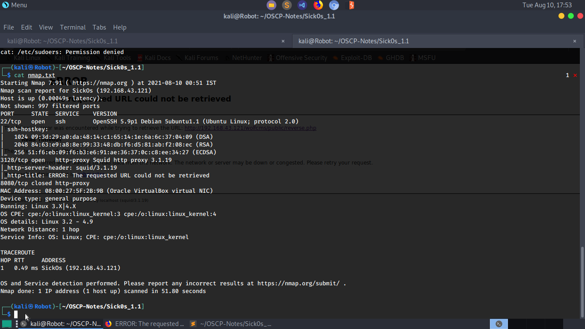
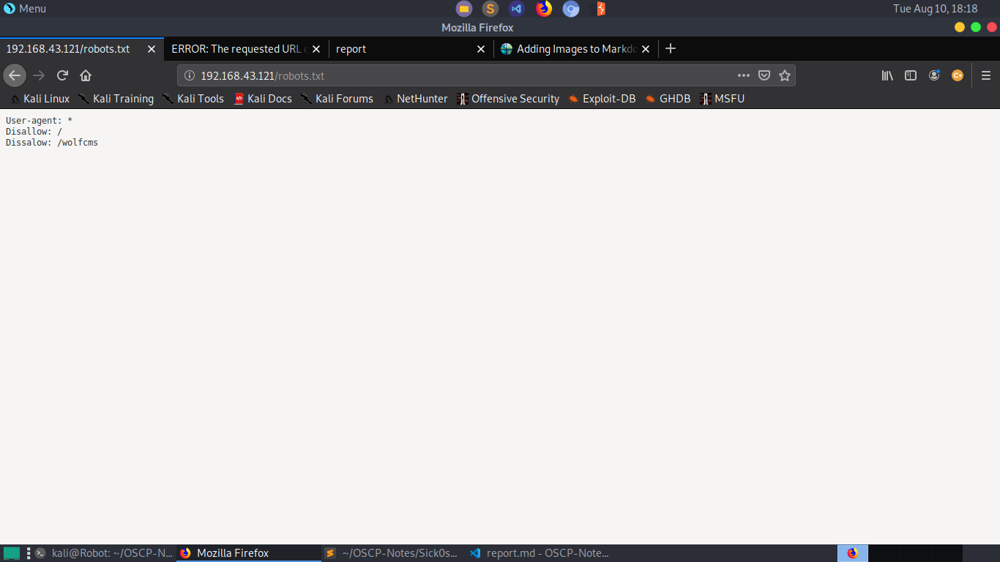

## Vulnerability Exploited: 
   1. Remote file upload and execution on php servers.
   2. Weak passwords
   3. Broken authentication while using the proxy server.
   
## Enumeration:
   * Run nmap scan  `sudo nmap -A -T4 <Machine IP>|tee nmap.txt`  to view open ports,versions of services and run the default scripts.
      
      
   * We can see *Squid http-proxy* running on port 3128.
   

## Gaining Access:
   * Configure your web browser according to proxy settings required.
   * After configuring, we find out that a webserver is running on port 80.
   * From **robots.txt** file, we find out that wolfcms is running we can access with the url    *<Machine IP>:80/wolfcms/*.
     
     

   * Running nikto in the background, we find out that a admin login page with url *<Machine IP>:80/wolfcms/?admin/login.php* exists.
   * Trying our luck, we put username:password as admin:admin.
   * Bingo!!! We logged in as **admin** :).
   * Navigating through the account we find out that we upload files.
   * We uploaded a php-reverse-shell ,started a netcat listener `nc -lvnp 4444` and then executed the file with url *<Machine IP>/wolfcms/
     public/reverse.php*.
   * BOOM!!! We got **Shell**.
   

## Priviledge Escalation:
   * First of all, we must upgrade out shell to python pty shell with command `python -c 'import pty;pty.spawn("/bin/bash")'`.
   * Navigating through our target, we find a file named **config.php** in which we find a password *john@123* for *root* user for *mysql 
     server* and a database *wolf*.
   * We logged into mysql with the credentials using the command `mysql --user=root --password=john@123 wolf`
   * We didn't find anything interesting in that database.
   * Using command `cat /etc/passwd`, we find out that there is interesting user named *sickos*(interesting because it is name of the target).
   * We tried to change user to *sickos* with  password *john@123* using command `su sickos`.
   * Bingo! We logged in as sickos.
   * `groups` command show that *sickos* is a member of *sudo* group and `sudo -l` shows that user *sickos* can run all commands as 
    superuser(root).
   * We used command `sudo /bin/bash`.
   * Yeah!!! We are **root** 

   
