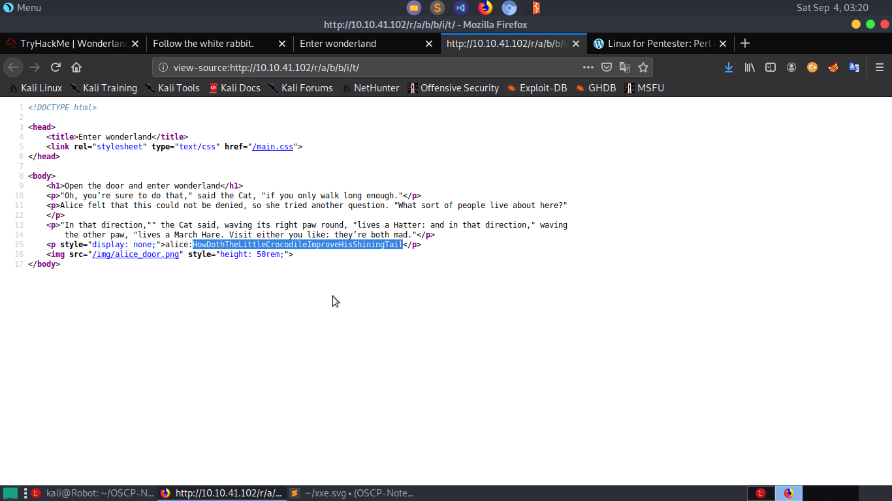

## Vulnerability Exploited: 
   1. Python library Hijacking
   2. Execution Flow Hijacking through PATH variable of a SUID binary.
   3. Setuid capability to perl 
   
## Enumeration:

Nmap:
* Run nmap scan  `sudo nmap -A -T4 <Machine IP>|tee nmap.txt`  to view open ports,versions of services and run the default scripts.
      
* We can see *ssh* is running in port 22 and *Golang web server* running in port 80.

Webpage:
	
* Title of the webpage is  **Follow the white rabbit**(Maybe some hint) 

Dirsearch:
* Now for directory enumeraration, we use dirsearch. We run the command : 
  `dirsearch -w /usr/share/wordlists/dirbuster/directory-list-2.3-medium.txt -u 10.10.41.102 `      
* We get a directory */r* in our first few searches. 

## Gaining Access:

* We visit the webpage */r* that we got from dirsearch. It seems we have to follow a paritcular path to find a certain web.
* Title of the webpage was **Follow the white rabbit** and we get directory a directory */r*. Maybe 2nd letter of rabbit is 
   the next directory. We visit the diretory */r/a* and it seems our guess was correct.
* We follow the same procedure by having each letter of rabbit as next directory and visit the directory */r/a/b/b/i/t* and the web page title says **Enter the Wonderland**. It seems like we have reached our destination.
	

* We take a look in the source of the webpage. And there we found a password for *alice* which should be the password for 
  ssh.
    

* We login as alice through ssh.
* We are in!!!
   
## Priviledge Escalation:
### Part 1
* We have logged in as alice. In the home directory of alice, we can see a python file and **root.txt** both owned by root.
	

* Using the command `sudo -l` ,we find out that alice can run execute `/usr/bin/python3.6 walrus_and_the_carpenter.py` as 
  user rabbit.
  	

* By reading the **walrus_and_the_carpenter.py**, we can see that the random library is being imported in the python program.
  First thing that comes in mind after seeing this is *Python Library Hijacking*. This vulnerabilty arises due to the fact that when a python library is imported in a program and the program is ran, the program first searches for the library in the directory in which the python program is located. 
* So, we can write our own *random.py* and make the python file execute it as rabbit. 
    
    Note: Setuid is set to be 1002 because that is the uid of rabbit which we can get from **/etc/passwd** file.

* Great!! We are user rabbit.

### Part 2
* We are user rabbit. We move to the home directory of rabbit, where we find a setuid executable **teaParty** owned by root.
* Running it show a **Segmentation fault** error which is sign of **buffer overflow**. But after reading the executable with 
  *cat*, we realise it was a rabbit hole. After further reading, we find out that the executable uses the *date* executable present in /usr/bin directory. 
  	

* We can exploit this code with *Execution Flow Hijacking* through PATH variable. 
* Using the command `echo "/bin/bash" > date` and `chmod 777 date`, we make our own *date* program.
* We need to set the *PATH* environment variable in such a way that the SUID program looks to the */home/rabbit* directory   
  for executables first. We use the command `export PATH=/home/rabbit:$PATH`
* We run the **teaParty** program now
	

* We are user hatter now!! Now we move to the hatter home directory and found password file. Most probably ssh password.
* Using the password, we try to login as hatter through ssh
	

* Great!!!  We are hatter.

### Part 3
* We have logged in as hatter.
* We run the command `getcap -r / 2>/dev/null` to get the capabilities.
  

* We can see that perl has **setuid** capabilities which means that with the help of perl we can change the uid 
  of a running perl process to whatever we want.

* We run the perl command `perl -e 'use POSIX (setuid); POSIX::setuid(0); exec "/bin/bash";'`
  

* Hurray!!! We are **ROOT** 